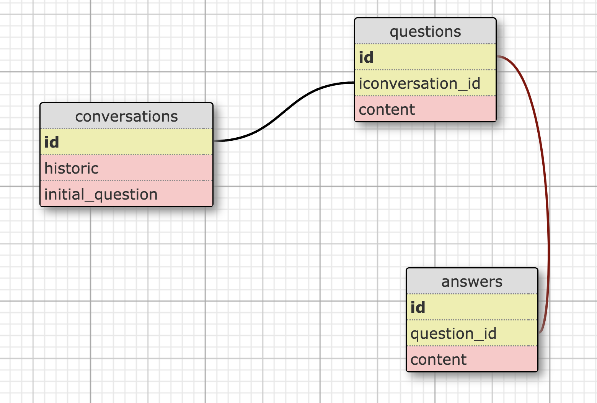

# IMPLEMENTATION OF ```ruby-openai``` GEM AND USAGE

## Basic implementation
Thanks to [Doug](https://github.com/dmbf29) Berkley for this [Notion Page](https://doug-berkley.notion.site/doug-berkley/Rails-ChatGPT-Service-Object-Setup-21748fc969514b978bf6345f897b6d3e)

### Rails ChatGPT Service Object Setup

1. add the [gem](https://github.com/alexrudall/ruby-openai) to the Gemfile

```ruby
# Gemfile
gem "ruby-openai"
```

Then `bundle install`

2. create a .env file if it doesn't exist (in Terminal)

```bash
touch .env
```

3. Add you secret access_token [from OpenAI](https://platform.openai.com/account/api-keys) and to the .env

```jsx
OPENAI_ACCESS_TOKEN=*****
```

4. create an initializer for the gem

```bash
touch config/initializers/openai.rb
```

5. config the gem to your secret keys (in your openai.rb)

```ruby
OpenAI.configure do |config|
  config.access_token = ENV.fetch("OPENAI_ACCESS_TOKEN")
  config.request_timeout = 240 # Optional
end
```

6. create a services folder in your app (in Terminal)

```bash
mkdir app/services
```

7. create a service object for Open AI (in Terminal)

```bash
touch app/services/openai_service.rb
```

8. Restart your server `rails restart`
9. setup the service object class

```ruby
# app/services/openai_service.rb
require "openai"

class OpenaiService
  attr_reader :client, :prompt 

  def initialize(prompt)
    @client = OpenAI::Client.new
    @prompt = prompt
  end

  def call
    response = client.chat(
      parameters: {
          model: "gpt-3.5-turbo", # Required.
          messages: [{ role: "user", content: prompt }], # Required.
          temperature: 0.7,
          stream: false,
	  max_tokens: 100 # might want to check this
      })
    # you might want to inspect the response and see what the api is giving you
    return response["choices"][0]["message"]["content"]
  end
end
```

10. Now this service object is usable anywhere in your app. Most likely you’ll use it in one of your controllers like:
```ruby
response = OpenaiService.new('whatever you want to ask it').call
```

## Implement a streaming conversation
By default the ```openai``` gem does not come with that feature, hence having to implement it yourself

1. Create your database with 3 tables (conversations, questions, answers) with thw following sctructure:




## Implementation of DAL-E

1. Implement a new ```generate_image``` method in the ```openai_service.rb``` file
```ruby
class OpenaiService
  attr_reader :client, :prompt 

  def initialize(prompt)
    @client = OpenAI::Client.new
    @prompt = prompt
  end

...

  def generate_image
    response = client.images.generate(parameters: { prompt: prompt, size: "256x256", n: 4 }) # multiple images with the "n: 4" option
    # return response.dig("data", 0, "url") # single result
    return response.dig("data").map { |url| url["url"]} # multiple results
  end
end
```
3. Use the ```generate_image``` action from the openai service object
```ruby
image_response = OpenaiService.new("whatever image description you wish").generate_image
```

## Resources:
- https://doug-berkley.notion.site/doug-berkley/Rails-ChatGPT-Service-Object-Setup-21748fc969514b978bf6345f897b6d3e
- https://github.com/alexrudall/ruby-openai

## Going Further:
- https://gist.github.com/alexrudall/cb5ee1e109353ef358adb4e66631799d
